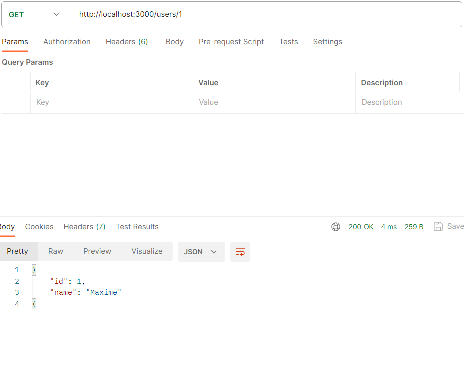
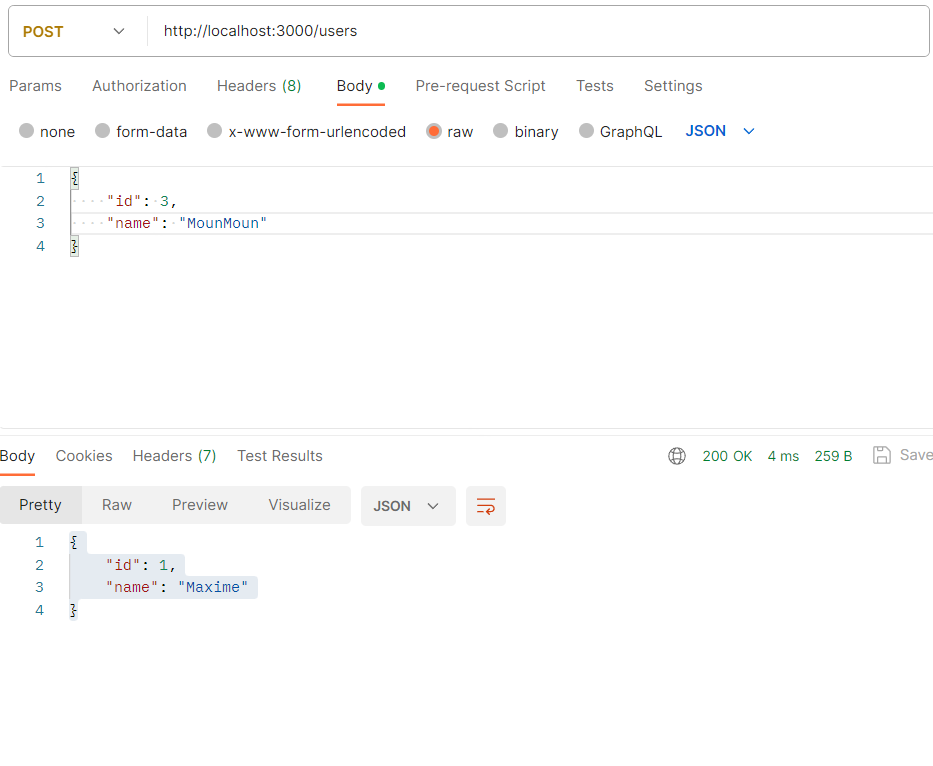

## Recherche et apprentissage sur REST

- API REST c'est quoi ? 

ResT est conçue pour utiliser des protocoles de communication standard et simplifier la création d'interfaces pour les services en ligne. Les API REST est utilisées dans le développement web en raison de sa simplicité  d'utilisation et de sa  compatibilité avec les protocoles HTTP existants. L'objectif est de favoriser l'interaction entre les clients et les serveurs.
Dans REST, les ressources `(Des données enregistrés comme Des nom de livres / des données de pokémons / des répertoire des taux de criminalité etc...)` sont accessibles via leurs `URI` (Uniform Resource Identifiers), et les interactions avec ces ressources sont réalisées via des méthodes HTTP standard, comme GET, POST, PUT, DELETE. le `CRUD` est un acronyme pour
 - Create, 
 - Read, 
 - Update, 
 - Delete. 

Se sont les quatre opérations de base que l'on peut effectuer sur les données dans une base de donnée,  dans le contexte d'une API REST, ces opérations CRUD sont généralement mappées à des méthodes HTTP : Create correspond à POST, Read à GET, Update à PUT ou PATCH, et Delete à DELETE.

  (Représentation rapide de ce que pourrais être un cas d'utilisation d'une API REST - Dans notre exemple Uber fait appel aux API de Google maps et des services bancaires. Dans le cas de google map, Uber na pas besoin d'avoir leur propres base de données avec les trajets / signalisations / route interdites / travaux, ils récupére tout directment depuis l'API jusqu'a leur interfarce. ) 

## Exemple de quelque principe REST avec "serveur.js" pour donner des exemple de 
- exemple de requête GET : 

- exemple de requête POST : 

- exemple de requête PUT : 
 

- exemple de requête DELETE : 
